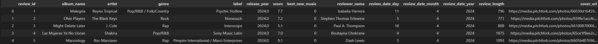

# Pitchfork Album Reviews : dataset, scraper, and analysis notebook

Little webscraping project of one of my favourite websites: online music magazine Pitchfork.

### The dataset:
The dataset contains 26404 reviews, spanning from January 12th, 1999 to April 13th, 2024. 

Columns are : 
- Album name.
- Artist.
- Genre.
- Label.
- Release year.
- Score given by Pitchfork.
- Whether the album was certified Best New Music or not.
- Pitchfork reviewer name.
- Review date (decomposed in 3 columns: day, month, year).
- Review word count.
- Url to album cover.

The dataset is available as a sqlite3 database as well as a csv file.

### The scraper:
The code that was used to build the database. It analyzes every Pitchfork reviews page, opens every album page and scrapes its data.

The scraper outputs a sqlite database, but you can easily convert it into a csv file with the 'from_sqlite_to_csv' util.

### The notebook:

Resulting data was subject to some analysis in order to answer a few questions the music lover I am had. Said analysis can be found in the data_analysis.ipynb notebook.
